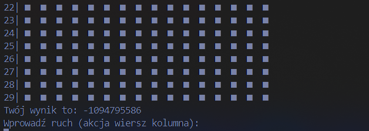

# minesweeper

I: 
- w zależności od argumentów wywołania (getopt) generowanie planszy (stuktury pól, planszy, generowanie min, ustawianie flag, odkrwyanie pola)
- wyświetlanie planszy
- aktualny winik gracz... (UI gry)
- zapisywanie i przechowywanie gdzies wynikow a na koniec wyswietlanie
- wczytywanie gracza przed rozpoczeciem

II:
- logika gry: wczytywanie ruchu z stdin, co sie dzieje po ruchu w zależności od tego na co trafił (odkrywanie) [game.c]
- sprawdzanie i wyswietlanie wyniku 
- wczytywanie gry z pliku

FIXME:
 -> start gry hard, chyba troche malo punktow XD, zero sie powinno wyswietlac chyba