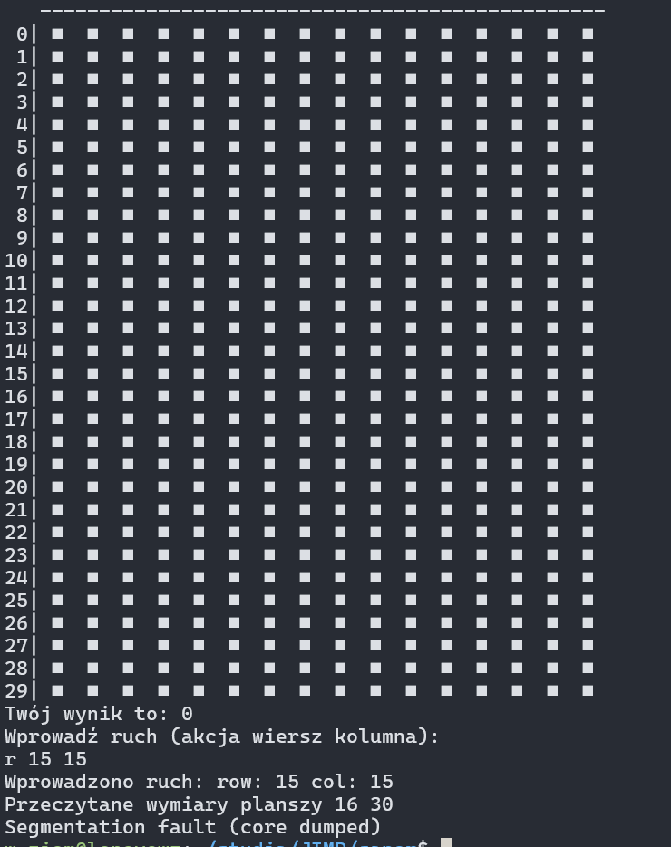

# minesweeper

I: 
- w zależności od argumentów wywołania (getopt) generowanie planszy (stuktury pól, planszy, generowanie min, ustawianie flag, odkrwyanie pola)
- wyświetlanie planszy
- aktualny winik gracz... (UI gry)
- zapisywanie i przechowywanie gdzies wynikow a na koniec wyswietlanie
- wczytywanie gracza przed rozpoczeciem

II:
- logika gry: wczytywanie ruchu z stdin, co sie dzieje po ruchu w zależności od tego na co trafił (odkrywanie) [game.c]
- sprawdzanie i wyswietlanie wyniku 
- wczytywanie gry z pliku

TODO:
- wczytywanie z pliku (ja nawet nie wiem o co chodzi XD)
- [Ja to ogarne] jak nie trafisz w mine to nie odkrywa tak dużo pól jak powinno, tylko zawsze jedno pole, powinno odkrywać wszyskie pola która nie przylegają do żadnej miny na raz, a u nas może być, że dotyka do 0 min, a i tak nie odkryją się w około - FUNKCJA REVEAL_SQUARES
DONE - zawsze tworzy się nowy plik - zawsze rzuca bład z lini 77 w score.c 
DONE - game 129 linijka

FIXME:
